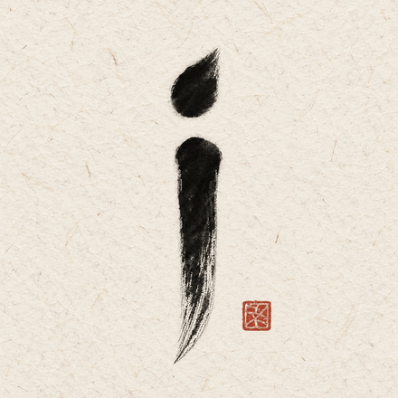
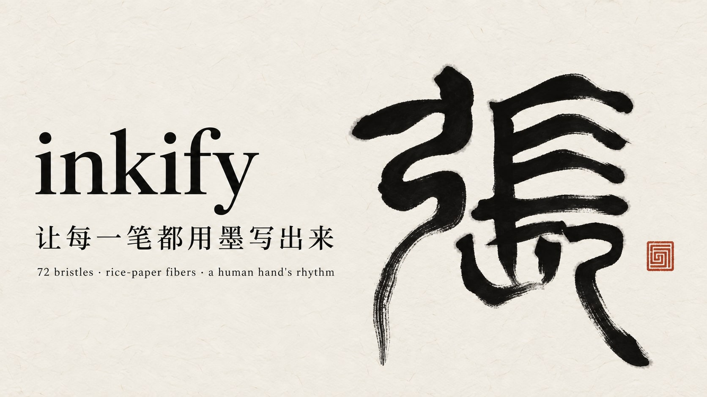
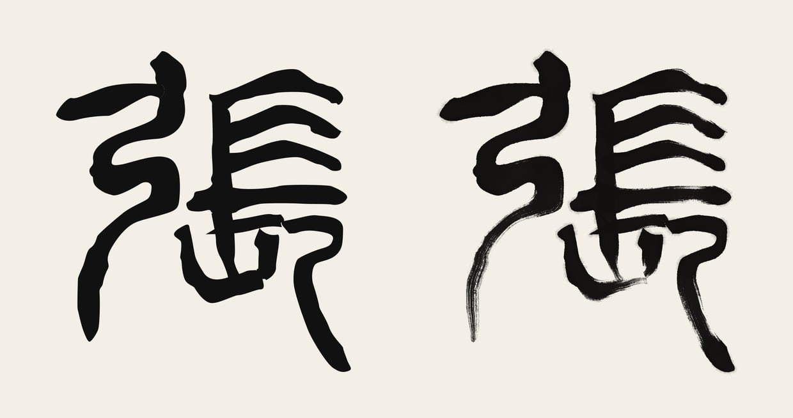

<p align="center">
  
</p>

<p align="center"><b>English</b> · <a href="README.zh-CN.md">简体中文</a></p>

# inkify: write characters in ink

inkify is an agent skill for Codex and Claude Code that writes a Chinese character on a web page the way a brush would: stroke by stroke, at a human hand's rhythm, in ink that runs dry, pools where the brush rests and bleeds into rice paper. The ink is rendered offline by a small brush-and-paper model; the page writes it with plain SVG and CSS, starting on first paint, with no JavaScript required.



<p align="center">
  <br>
  <sub>張, written by inkify at the rhythm of take 2 (the intro of <a href="https://kizzhang.com">kizzhang.com</a>)</sub>
</p>

## From vector wipe to ink



Stroke-order animations usually sweep a constant-width mask along each stroke and fill the outline with flat black (Hanzi Writer, the SVG `stroke-dashoffset` trick). That reads as a silhouette. inkify keeps the same outlines and centerlines and adds three things:

- **A brush:** 72 bristles in clumps that share ink. Edge hairs run dry first, and wherever a hair's ink no longer beats the paper's tooth it skips, leaving 飞白 (dry-brush streaks).
- **Paper:** about 9,000 fibers over fine grain. The same sheet decides where 飞白 falls, how the edges fray, and where 洇墨 (the ink bleeding into the paper) wicks along the fibers.
- **A hand:** a motor-control timing model covering isochrony, the two-thirds power law, bell-shaped speed, touch-down and corner rests, and longer pauses between components. Every take varies slightly under its own seed, so no two writings are identical. The ink reads this timing too, so it pools exactly where the brush rests.

The full method and the research behind each part: [references/method.md](references/method.md) · [references/timing.md](references/timing.md).

## 30-second start

Install into your personal skills folder (Node 18+):

```bash
# Codex
git clone https://github.com/kizzhang/inkify.git ~/.codex/skills/inkify
# Claude Code
git clone https://github.com/kizzhang/inkify.git ~/.claude/skills/inkify
```

```powershell
# Windows (PowerShell), Codex
git clone https://github.com/kizzhang/inkify.git "$env:USERPROFILE\.codex\skills\inkify"
```

Optional: `npm install` inside the folder adds `sharp`, which writes the ink atlas as WebP (about 3× smaller than PNG).

Then ask your agent:

```text
Use $inkify to write 永 in brush and ink for my homepage intro. Show me three takes to pick from.
```

Or open [examples/zhang/out/index.html](examples/zhang/out/index.html) to see a finished page.

## Commands

The agent runs these itself. You can also run them directly:

```bash
node scripts/inkify.mjs doctor                       # Node version, WebP support
node scripts/inkify.mjs all 永                        # fetch → timing → ink → page, into ./inkify-out/永
node scripts/inkify.mjs all 永 --takes 3              # three takes and compare.html, to pick one
node scripts/inkify.mjs all my-strokes.json          # your own outlines and centerlines
node scripts/inkify.mjs render inkify-out/永 --dryness 1.3 --bleed 0.7
```

Each step (`fetch` / `import`, `timing`, `render`, `build`) reads and writes one folder, so you can edit `character.json` (endings 出锋 / 顿笔, components, tempo) and rerun just the step that changed. `node scripts/check.mjs` runs the self-test.

## What you get

```text
index.html      a page that writes the character (replay button included)
writer.html     the SVG markup to paste into your own page
inkify.css      the keyframes: brush, touch-down, bleed, hand-over, reduced motion
ink.webp        every stroke's ink in one atlas (~70–120 KB)
inkify.json     traces, timing and ink boxes, for your own renderer
ink-writer.js   inkWriterSVG(data) → the same markup, for any framework
preview.png     the finished ink, to check before building
```

For React there is [templates/InkWriter.tsx](templates/InkWriter.tsx). How to embed it, preload the atlas and keep first-paint writing: [references/embedding.md](references/embedding.md).

## Skill entry points

- Workflow for the agent: [SKILL.md](SKILL.md)
- How the ink is made, and the sources: [references/method.md](references/method.md)
- The motion model: [references/timing.md](references/timing.md)
- Knobs and fixes: [references/tuning.md](references/tuning.md)
- Putting it on a site: [references/embedding.md](references/embedding.md)
- CLI: [scripts/inkify.mjs](scripts/inkify.mjs)

## Data and credits

`fetch` downloads stroke data from [hanzi-writer-data](https://github.com/chanind/hanzi-writer-data) (derived from [Make Me a Hanzi](https://github.com/skishore/makemeahanzi), Arphic Public License). These outlines come from a regular-script font. A character you trace yourself from real brush writing looks far more alive, and `import` accepts it directly. See [NOTICE.md](NOTICE.md).

The logo and banner were generated with Codex image generation ([prompts](assets/imagegen-prompts.md)); the demo animation and comparison were rendered by inkify.

## License

MIT. See [LICENSE](LICENSE).
